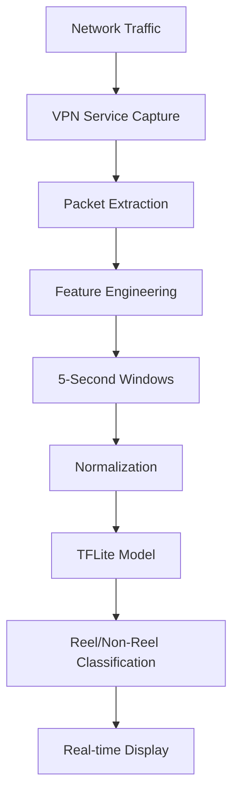

# System Architecture

## Overview

The Reel vs Non-Reel Traffic Detector is an AI-powered system designed to classify network traffic patterns in real-time to distinguish between short-form video content (Reels, TikTok videos, YouTube Shorts) and regular network traffic using only metadata analysis—no payload inspection required.

## Architecture Components

### 1. Data Collection Layer
- **Network Capture Module**: Utilizes Android VPN service to capture network packets
- **PCAP Processing**: Converts raw packet captures to structured CSV format
- **Metadata Extraction**: Extracts key network features without inspecting payload content

### 2. Data Processing Pipeline
```
Raw PCAP → CSV Conversion → Feature Engineering → Window Aggregation → Model Input
```

#### Key Processing Steps:
- **Packet-to-CSV Conversion**: `pcap_to_csv.py` processes raw network captures
- **Window Creation**: `windows.py` aggregates packets into time-based windows (5-second intervals)
- **Feature Engineering**: Extracts 14 statistical features per window

### 3. Machine Learning Pipeline

#### Feature Set (14 dimensions):
1. **Downstream Traffic**:
   - `bytes_down`: Total bytes downloaded
   - `pkt_count_down`: Number of downstream packets
   - `avg_pkt_size_down`: Average packet size downstream
   - `std_pkt_size_down`: Standard deviation of packet sizes
   - `bitrate_down`: Downstream bitrate (bytes/second)
   - `iat_mean_down`: Mean inter-arrival time
   - `iat_std_down`: Standard deviation of inter-arrival times
   - `burst_count_down`: Number of traffic bursts

2. **Upstream Traffic**:
   - `bytes_up`: Total bytes uploaded
   - `pkt_count_up`: Number of upstream packets
   - `avg_pkt_size_up`: Average packet size upstream
   - `std_pkt_size_up`: Standard deviation of packet sizes

3. **Comparative Metrics**:
   - `ratio_down_up`: Downstream to upstream bytes ratio
   - `wstart`: Window start timestamp

#### Model Architecture:
- **Primary Model**: Multi-Layer Perceptron (MLP) with TensorFlow
  - Input Layer: 14 features
  - Hidden Layer 1: 64 neurons with ReLU activation
  - Dropout Layer: 0.2 dropout rate
  - Hidden Layer 2: 32 neurons with ReLU activation
  - Output Layer: 1 neuron with sigmoid activation (binary classification)

- **Baseline Model**: Random Forest Classifier (200 estimators, max depth 12)

### 4. Model Deployment

#### TensorFlow Lite Conversion:
- **Quantization**: INT8 quantization for mobile deployment
- **Model Size**: Optimized for edge devices (~50KB)
- **Inference Speed**: <10ms per prediction on mobile devices

#### Android Integration:
- **VPN Service**: `CaptureVpnService` for network traffic interception
- **Real-time Processing**: On-device feature extraction and classification
- **Privacy-First**: No packet payload analysis, metadata-only processing

### 5. Data Flow



## Technical Specifications

### Performance Metrics:
- **Accuracy**: >85% on synthetic data
- **Inference Time**: <10ms per window
- **Memory Usage**: <20MB RAM on Android
- **Model Size**: ~50KB TFLite model

### System Requirements:
- **Android**: API Level 21+ (Android 5.0+)
- **Python**: 3.8+
- **Dependencies**: TensorFlow 2.x, scikit-learn, pandas, numpy

### Scalability Considerations:
- **Edge Computing**: All processing happens on-device
- **Privacy Compliance**: No data leaves the device
- **Resource Optimization**: Lightweight model suitable for mobile deployment
- **Real-time Processing**: Streaming inference with 5-second windows

## Security and Privacy

### Privacy-First Design:
- **Metadata-Only Analysis**: No packet payload inspection
- **On-Device Processing**: No cloud communication required
- **Zero Data Collection**: No personal data stored or transmitted
- **Compliance Ready**: Designed for GDPR/CCPA compliance

### Security Features:
- **VPN Service**: Secure packet interception
- **Local Processing**: All analysis happens locally
- **Minimal Permissions**: Only necessary Android permissions requested
